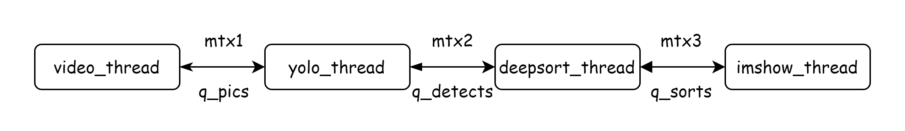

# Yolov5-DeepSORT-TensorRT
English | [简体中文](./README.md)

<div align=center>

</div>

# Introduction

- This project is a C++ implementation of [Yolo-DeepSORT](https://github.com/ZQPei/deep_sort_pytorch) using TensorRT for inference;
- Provides a Dockerfile for quick setup of the development environment;
- Simply provide the ONNX file, and when creating the model instance, it will automatically parse the ONNX and serialize the engine file (*.trtmodel) to the workspace directory;
- My other PyTorch version implementation, including line-crossing detection for pedestrian counting: [Yolov5_Deepsort_Person_Count](https://github.com/Tongkaio/Yolov5_Deepsort_Person_Count)

# Quick Start
## 💻 Environment Setup
Refer to the [README](docker/README.md) to use the Docker container, or configure manually as follows:
- python: 3.8
- cuda: 11.2
- cudnn: 8.2.2.26
- tensorRT: 8.0.3.4
- protobuf: 3.11.4

## 📥 Download Video & Models
Create a workspace directory:
```shell
mkdir workspace
```

Download files to the workspace directory:

|     File      |                             Link                             |
| :-----------: | :----------------------------------------------------------: |
| onnx, test.mp4 | [Download](https://pan.baidu.com/s/1HNveFo1S4RgXx1JlXMaSwA) (code: zxao) |

- yolov5s.onnx is exported from [yolov5-6.0](https://github.com/ultralytics/yolov5/tree/v6.0), and the ONNX model for deepsort is exported from [deep_sort_pytorch](https://github.com/ZQPei/deep_sort_pytorch). Refer to the script [exportOnnx.py](https://github.com/GesilaA/deepsort_tensorrt/blob/master/exportOnnx.py) for more details.
- ptq_yolov5s.onnx is a quantized model. For reference, see https://github.com/Tongkaio/yolov5_quant.

## 🏃‍ Run
Modify the relevant header and library paths in the MakeFile (if you are using a container created from the provided Dockerfile, this step is not needed), then execute:
```shell
make run
```

Inference results will be displayed during runtime, press ESC to exit.

Currently, on a GeForce RTX 2060, the inference speed for test.mp4 is approximately 40 ms/frame.

# File Descriptions
- Infer, Yolo, and DeepSORT are encapsulated using interface mode and RAII:
  - [infer.h](src/infer/infer.h)， [yolo.h](src/yolo/yolo.h)，[deepsort.h](src/deepsort/include/deepsort.h) only expose `create_*` and **inference** interfaces.
  - Use `create_*` to create object instances, which will automatically parse the ONNX file, generate, and load the engine.

- [infer.cpp](src/infer/infer.cpp): Divides into four threads, with producer-consumer relationships between each pair:



# References
- https://github.com/GesilaA/deepsort_tensorrt
- https://github.com/onnx/onnx-tensorrt/tree/release/8.0
- https://github.com/shouxieai/tensorRT_Pro